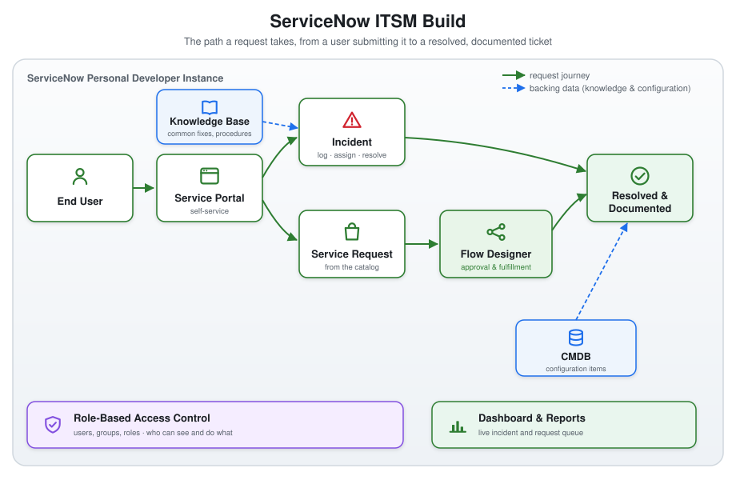
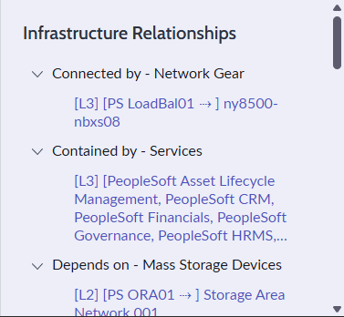
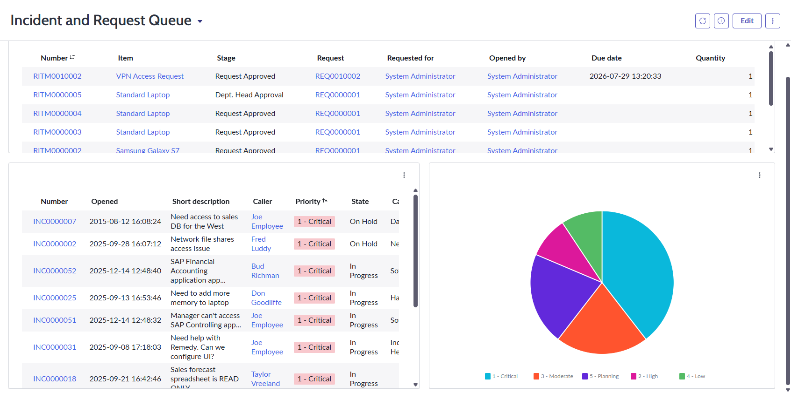

# ServiceNow IT Service Management Build in a Personal Developer Instance

A hands-on IT Service Management (ITSM) build in a free ServiceNow Personal Developer Instance (PDI). I worked the platform the way a service desk agent does and documented each piece here so the work is reproducible and easy to verify.

My background is infrastructure, automation, and security, and I hadn't used ServiceNow hands-on before this. So I used it for real, end to end, and wrote down exactly what I did.

The actual work happened in the browser inside the PDI. This repository is the record of that work, with screenshots and step-by-step notes for every piece.

## What This Builds

A small but complete ITSM slice in one instance, covering the core help desk workflow from a user's request through to a resolved ticket backed by a knowledge base and a configuration record.

- **Incident and request management.** Log, categorize, prioritize, assign, and resolve incidents and requests, and read the queue from a dashboard.
- **A service catalog item with a Flow Designer workflow.** A request the end user submits from the portal that kicks off an automated approval and fulfillment flow.
- **Knowledge base articles.** Two articles that document a common fix and a standard procedure, the way a real knowledge base reduces repeat tickets.
- **Role-Based Access Control (RBAC).** Users, groups, and roles set up so the right people see and do the right things, and nobody sees what they should not.
- **A Configuration Management Database (CMDB) example.** An existing configuration item, complete with its seeded relationships, linked to an incident so the ticket shows the asset it affects.

Each area maps to a standard piece of IT service desk work. See [How This Maps to Help Desk Work](#how-this-maps-to-help-desk-work) below.

## Platform

| Layer | What I used |
|---|---|
| Instance | ServiceNow Personal Developer Instance (free, full platform) |
| Framework | ITIL 4 service management practices |
| Incident and request | Incident, Service Catalog, and Request tables with assignment and priority |
| Automation | Flow Designer for catalog request approval and fulfillment |
| Knowledge | Knowledge Base with categorized articles |
| Access | Users, groups, roles, and access control |
| Configuration | CMDB tables, configuration items, and CI relationships |
| Reporting | Lists, filters, dashboards, and reports |

## Why It Exists

ServiceNow is the system of record for IT support at most large organizations. Reading about it is not the same as using it, so this project is me using it. I stood up each capability in a real instance, ran a realistic ticket through it, and documented the steps and the result. The repository shows the full path a request takes, from a user submitting it to a resolved ticket tied to a knowledge article and a configuration item.

## Current Status

The instance is live, every area is built, and every section below is written up with screenshots from the instance.

| Component | Status |
|---|---|
| Personal Developer Instance provisioned | Done |
| Incident management | Done |
| Request management | Done |
| Service catalog item | Done |
| Flow Designer workflow | Done |
| Knowledge base articles | Done |
| Role-Based Access Control (users, groups, roles) | Done |
| CMDB example | Done |
| Dashboard and reporting | Done |

## The Build

Each section below covers what I did, why, the steps to reproduce it, and a screenshot.

### 1. Incident and request management

**Incident management is done.** I logged INC0010003 against a real problem I'd already solved and written up as a knowledge base article. A Linux client couldn't reach hosts behind a Tailscale subnet router. Caller, category (Network), and short description came first, then impact and urgency, which ServiceNow uses to calculate a read-only priority field rather than letting an agent pick priority directly. One workstation affected (Impact: 3 - Low) blocking the user's work (Urgency: 2 - Medium) came out to Priority 4 - Low. Assignment group went to Network.

I worked it through its full lifecycle: New, then In Progress with a work note recording the actual diagnosis (Tailscale doesn't accept advertised subnet routes on Linux by default, the fix is `tailscale set --accept-routes`), then Resolved with a resolution code and notes, then Closed. Closing it dropped it out of an Active = true filter, which is the behavior that filter is supposed to have.

I also built and saved a filtered, prioritized list of active incidents, sorted so 1 - Critical tickets sort to the top, the way a real service desk queue would read.

The full worklog, including a couple of wrong turns (the Self Service view isn't the agent view, and my first explanation for why the Assigned to picker rejected an account turned out to be wrong), is in [WALKTHROUGH.md](WALKTHROUGH.md#step-1-incident-management).

**Request management is done.** I ordered a Standard Laptop from the Service Catalog with an optional software selection, and followed it all the way through fulfillment. One order creates three linked records, and the split is the whole point. REQ0010001 is the request, what was ordered and approved. RITM0010001 is the requested item, which laptop with which options. SCTASK0010001 and SCTASK0010002 are the catalog tasks, the actual work of pulling it from stock and deploying it to the user.

Approval ran two layers deep, once at the request and again at the item for department head sign-off, and the item's Stage field is read-only because the workflow owns it. Closing the last task closed the item and the request on their own. I never set those states by hand, which is the structural difference from an incident.

The step also cost me time on a field that kept returning an empty picker, and the fix touched real admin work. Assigned to on a catalog task filters to members of the assignment group, so it stayed empty first because the form had no Assignment group field at all, then again because the Field Services group had zero members. Fixing it meant editing the form layout and adding a user to a group. Both are written up in [WALKTHROUGH.md](WALKTHROUGH.md#step-2-request-management).

### 2. Service catalog item with a Flow Designer workflow

**Done.** The laptop order above consumed a catalog item ServiceNow ships with the instance. This one I built from nothing, which is the difference between using the platform and configuring it.

The item is a VPN Access Request with three variables the requester fills in, a business justification, how long access is needed, and whether they're connecting from a company-managed laptop or a personal device. That last question is on the form because the answer changes the risk of granting the access, so it belongs in the record rather than in a follow-up email.

The flow behind it runs on Flow Designer, not the legacy Workflow engine that drives the demo content. Four steps. Ask for approval from the Network group, check whether the approval came back approved, create a fulfillment task for that group, and close the requested item once the task is done.

I drove it end to end in all three roles, as the requester, the approver, and the fulfiller. The interesting part is that it failed the first run. The task closed and the requested item stayed open, because the legacy workflow in the walkthrough's Step 2 had closed its parent records automatically and I assumed a flow would too. It doesn't. Flow Designer only does what you write, so the closing step was missing. I added it, re-ran the whole thing on a fresh request, and watched the requested item close itself one second after the task did.

The full account, including the wrong category I picked first and the one cosmetic gap I left unfixed, is in [WALKTHROUGH.md](WALKTHROUGH.md#step-3-service-catalog-item-with-a-flow-designer-workflow).

### 3. Knowledge base articles

**Done.** I published two articles I'd already written, [KB0010001, a Tailscale subnet routing fix](knowledge-base/kb01-linux-tailscale-subnet-routes.md), and [KB0010002, an SSH key-based authentication hardening procedure](knowledge-base/kb02-ssh-key-based-authentication.md), into the instance's IT knowledge base. Neither of the categories the drafts specified existed out of the box, so I added Network and Remote Access and Security and Hardening to the knowledge base rather than force them into a category that didn't fit.

The article editor is a block-based page builder, not a plain text field. I converted each draft to HTML and pasted it into the editor's raw code view instead of building it block by block. Publishing routes through an approval workflow, and along the way I copy-pasted my own instruction text into a Short description field by mistake, catching it live on the published article and fixing it through a Checkout action.

I logged a second incident, INC0010012, tied to the SSH hardening article, and linked the article to it directly from the incident form.

The full account, including the block editor, the approval workflow, and the short description bug, is in [WALKTHROUGH.md](WALKTHROUGH.md#step-4-knowledge-base-articles).

### 4. Role-Based Access Control

**Done.** I created two users, a fulfiller added to the Network group from the walkthrough's Step 3 flow with the itil role, and a requester left as an ordinary user with no group and no elevated role. Impersonating each in turn showed the actual difference. The requester's incident list showed only the one ticket they'd opened, while the fulfiller's list showed that same ticket before I'd even set an Assignment group, which rules out group membership and points at itil's broader read access instead. I assigned it to the fulfiller, worked it to In Progress, and resolved it, tying the Network group back to the same one used for the walkthrough's Step 3 approval routing rather than a throwaway example.

Adding the itil role pulled in 46 roles total, itil bundles a large contained set by design. I also hit a real ServiceNow quirk. A second group kept reappearing on the fulfiller's record no matter how many times I removed it by hand, most likely role-based automatic group membership rather than anything I'd set directly, though I didn't track down the exact role responsible. Full account in [WALKTHROUGH.md](WALKTHROUGH.md#step-5-role-based-access-control).

### 5. CMDB example

**Done.** The instance ships with roughly 2,800 configuration items already seeded in, so rather than inventing a server that corresponds to nothing, I found `PS LinuxApp01`, an existing Linux server CI whose name already matches INC0010012's own description of a Linux application server. It came with real infrastructure relationships attached, connected by network gear, contained by a set of PeopleSoft services, and depending on mass storage devices, which satisfied the relationship part of this step with data that was already true rather than a pair of records built to order.

I set it as INC0010012's Configuration item and resolved the ticket with "Solution provided" as the resolution code, since the actual fix is the procedure in KB0010002, not a change applied to any live system in this instance. INC0010012 had been open since the walkthrough's Step 4 waiting on exactly this, and closing it makes it the second incident in the project, after INC0010003, to run its full lifecycle to Closed.

The full account, including the wrong turns finding the right CMDB module, is in [WALKTHROUGH.md](WALKTHROUGH.md#step-6-cmdb-example).

### 6. Dashboard and reporting

**Done.** A Platform Analytics dashboard called "Incident and Request Queue" with three elements: a list of the 43 active incidents, a list of the 6 active requested items, and a pie chart breaking the incident queue down across all five priority levels. Everything is filtered on Active is true, the same logic as the saved list from the incident management section, rebuilt here as dashboard widgets.

The full account, including three failed attempts at finding the reporting module and one cosmetic thing I couldn't get working, is in [WALKTHROUGH.md](WALKTHROUGH.md#step-7-dashboard-and-reporting).

## How This Maps to Help Desk Work

This build is scoped against the responsibilities that come up in most IT service desk roles. The mapping:

| Service desk work | Where it shows up here |
|---|---|
| Evaluate and assign incidents and requests, document them in ServiceNow dashboards and reports | Incident and request management, plus the dashboard |
| Fulfill service requests through the ServiceNow portal within service level agreements (SLAs) | Service catalog item with the Flow Designer workflow |
| Research and create knowledge articles to document IT processes and common fixes in the ServiceNow knowledge base | Knowledge base articles |
| Diagnose and resolve complex incidents, perform root cause analysis in ServiceNow | Incident management linked to CMDB configuration items |
| Handle sensitive information and maintain confidentiality | Role-Based Access Control |

## How to Reproduce

The full step-by-step worklog, with screenshots and the parts that did not go smoothly, is in [WALKTHROUGH.md](WALKTHROUGH.md).

1. Sign up for a free ServiceNow Personal Developer Instance at [developer.servicenow.com](https://developer.servicenow.com).
2. Follow the numbered sections under [The Build](#the-build) in order. Each one lists the steps I took and what to click.
3. Compare your result against the screenshots in `images/`.

## References

- [ServiceNow Developer Program](https://developer.servicenow.com)
- [ServiceNow Product Documentation](https://www.servicenow.com/docs/)
- [ITIL 4 service management practices](https://www.axelos.com/certifications/itil-service-management)
- [aws-ha-infra](https://github.com/umraffer32/aws-ha-infra), my AWS high-availability infrastructure project in the same documentation style
