# Build Walkthrough

_Last updated: August 19, 2026_

This is the actual worklog. The [README](README.md) says what the project is and the [build plan](BUILD_PLAN.md) lays out the steps. This file is where I record what I actually did, in order, with screenshots, so the whole thing is reproducible from scratch.

I am building in a free ServiceNow Personal Developer Instance (PDI). Each step below is the real work as it happened, including the parts that did not go smoothly.

## Contents

- [Step 0. Set up the developer instance](#step-0-set-up-the-developer-instance)
  - [Create a ServiceNow ID](#create-a-servicenow-id)
  - [Get to the right place](#get-to-the-right-place)
  - [Finish the developer onboarding](#finish-the-developer-onboarding)
  - [Request the instance](#request-the-instance)
  - [Reality check: the free instance pool was full](#reality-check-the-free-instance-pool-was-full)
- [Step 1. Incident management](#step-1-incident-management)
  - [Finding the incident form](#finding-the-incident-form)
  - [Logging the incident](#logging-the-incident)
  - [Working the incident through its states](#working-the-incident-through-its-states)
  - [Resolving and closing the incident](#resolving-and-closing-the-incident)
  - [Building a filtered list of active incidents](#building-a-filtered-list-of-active-incidents)
- [Step 2. Request management](#step-2-request-management)
  - [Ordering from the service catalog](#ordering-from-the-service-catalog)
  - [Request, Requested Item, and Catalog Task](#request-requested-item-and-catalog-task)
  - [Why the Assigned to field kept coming back empty](#why-the-assigned-to-field-kept-coming-back-empty)
  - [A second task, and the same problem for a different reason](#a-second-task-and-the-same-problem-for-a-different-reason)
  - [The chain closing itself](#the-chain-closing-itself)
- [Step 3. Service catalog item with a Flow Designer workflow](#step-3-service-catalog-item-with-a-flow-designer-workflow)
  - [Building the catalog item](#building-the-catalog-item)
  - [Building the flow](#building-the-flow)
  - [Testing it as requester, approver, and fulfiller](#testing-it-as-requester-approver-and-fulfiller)
  - [Where it fell short, and the fix](#where-it-fell-short-and-the-fix)
- [Step 4. Knowledge base articles](#step-4-knowledge-base-articles)
  - [Logging a fresh incident](#logging-a-fresh-incident)
  - [Finding an assignment group](#finding-an-assignment-group)
  - [Assigning and working the incident](#assigning-and-working-the-incident)
  - [Finding the knowledge base module](#finding-the-knowledge-base-module)
  - [Adding the two categories](#adding-the-two-categories)
  - [Writing KB01 in the block editor](#writing-kb01-in-the-block-editor)
  - [Publish, approve, and a copy-paste bug](#publish-approve-and-a-copy-paste-bug)
  - [KB02, the same process, no repeat of the bug](#kb02-the-same-process-no-repeat-of-the-bug)
  - [Linking KB02 to the incident](#linking-kb02-to-the-incident)
- [Step 5. Role-Based Access Control](#step-5-role-based-access-control)
  - [Proving access follows role](#proving-access-follows-role)
- [Step 6. CMDB example](#step-6-cmdb-example)
- [Step 7. Dashboard and reporting](#step-7-dashboard-and-reporting)

## Step 0. Set up the developer instance

Before any IT Service Management (ITSM) work, I needed a working instance to build in.

### Create a ServiceNow ID

I went to developer.servicenow.com and created a free ServiceNow ID. The sign-up sends a six digit code to your email to confirm the account.

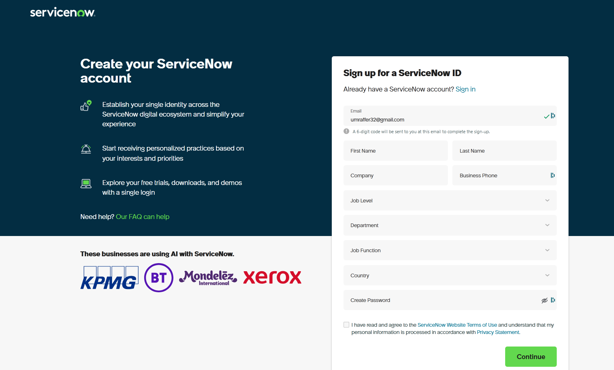

### Get to the right place

One thing worth flagging for anyone following along. After signing in, I first landed on the corporate MyNow site, which is not where you build. It is a product portal with a promo video and nothing to do with a developer instance. The Personal Developer Instance lives on developer.servicenow.com, so if you end up on MyNow, go back to the developer site.

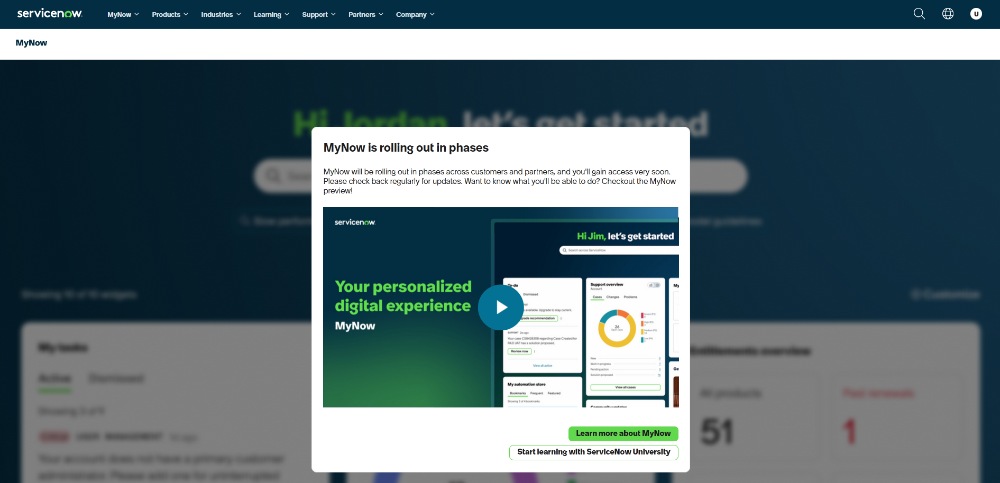

### Finish the developer onboarding

The developer portal runs a short two question setup. I said yes to coding since I want the developer tools, and picked IT Admin as the closest role. Neither answer changes the instance, they just tune the portal.

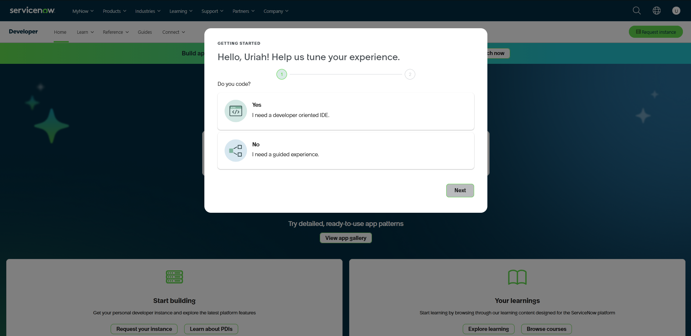

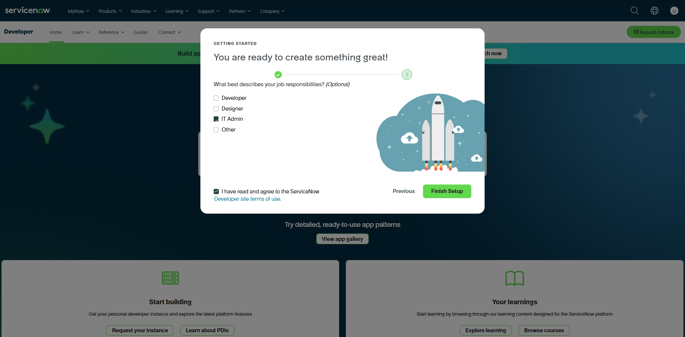

### Request the instance

From the developer home page I clicked Request Instance.

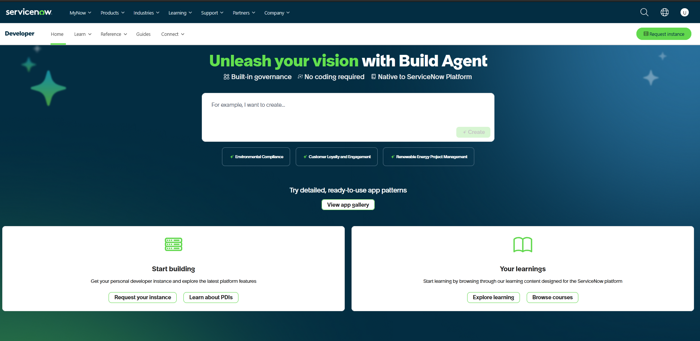

It asked which release to build on. Australia was the latest release and the only one with instances available, so I chose it. The other two releases showed no instances available.

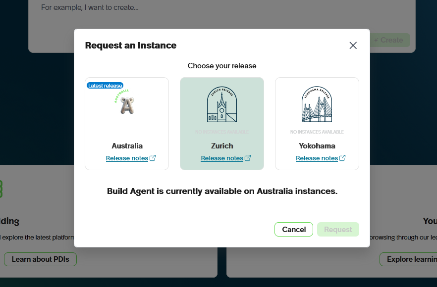

The request kicked off and the instance went into provisioning.

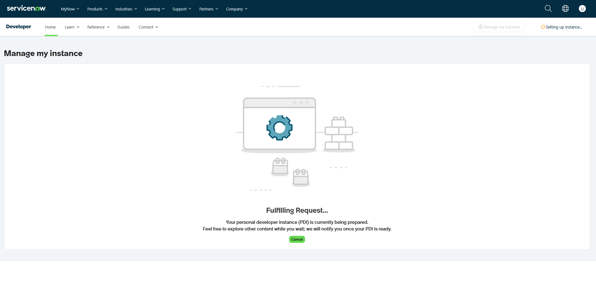

### Reality check: the free instance pool was full

The provisioning did not finish. The first request failed, the second request failed, and on the third try the only option offered was to join a waitlist. This is the free tier behaving as designed when demand is high. The pool of available instances runs dry and new requests queue until one frees up.

I joined the waitlist. ServiceNow emails you when an instance is allocated. Nothing here is broken or misconfigured on my end, it is a capacity limit on the free program, so the move is to wait for the allocation and pick the build back up the moment it lands.

**Status: waiting on instance allocation as of June 11, 2026.** Everything below is staged and ready to build the moment the instance is live.

**Update, July 9, 2026: the instance came off the waitlist.** Logged in as admin on the Australia release with no issues. Picking the build back up at Step 1.

## Step 1. Incident management

Goal: log an incident with a caller, category, and priority from impact and urgency, work it through its states with work notes, resolve it, and build a filtered list view of active incidents.

### Finding the incident form

I typed "Incident" into the All menu and landed on an Incident list filtered to Self Service, with one row already in it: INC0008111, "ATF: Test1". That's ServiceNow's own out-of-box demo data, not mine.

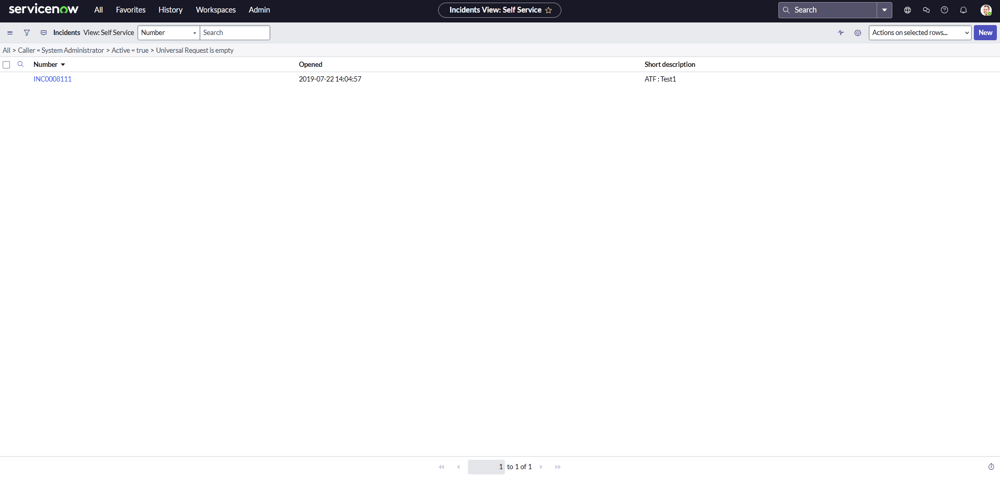

Clicking New from here gave me a stripped-down form: Number, Caller, Watch list, Urgency, State, Short description, Additional comments. Nothing for Category, Impact, Priority, or Assignment group.

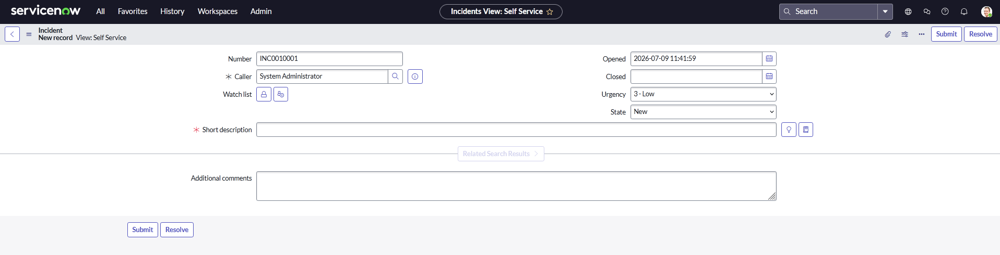

That's the Self Service view, the simplified layout meant for an end user submitting their own ticket from the portal. It's not what an agent works from. I right-clicked the list header and found a View submenu with the actual list of views the instance has configured: Default view, Indicators Panel, Major incidents, Mobile, Portal, Self Service (the one I was on), Service Operations Workspace, and a few report-specific views.

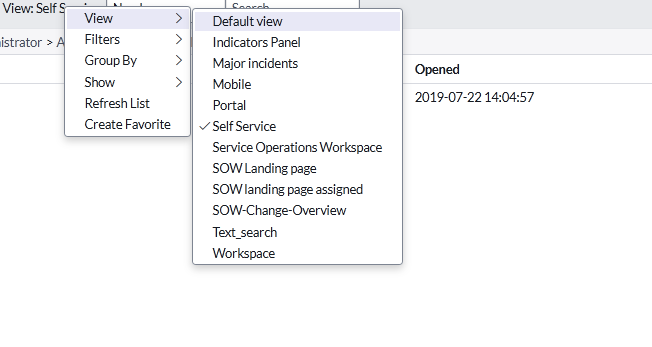

Switching to Default view reloaded the list with the columns an agent actually needs: Priority, State, Category, Assignment group, Assigned to.

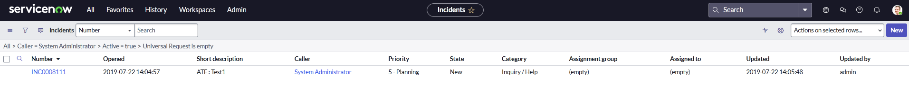

### Logging the incident

From Default view, New opens the full form: Caller, Category, Subcategory, Service, Assignment group, Impact, Urgency, Priority, State, plus Notes and Resolution Information tabs further down.

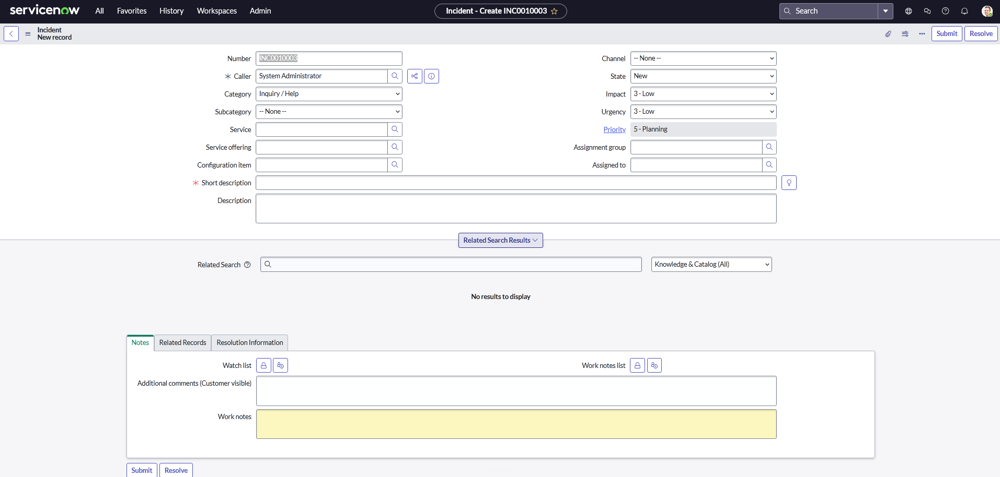

I logged this one against a real problem I'd already written up as a knowledge base article, so the incident and the KB article tie together later in Step 4. Caller stayed System Administrator. Category: Network. Short description: "Linux workstation cannot reach internal hosts behind Tailscale subnet router."

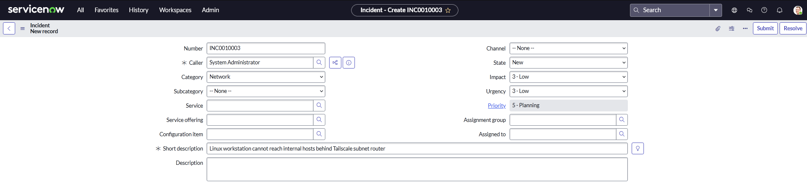

For Impact and Urgency, only one workstation was affected, not a site or a team, so Impact went to 3 - Low. It was blocking the user's work but nothing was down, so Urgency went to 2 - Medium. Priority is a read-only field ServiceNow derives from the Impact x Urgency matrix, and it calculated to 4 - Low.

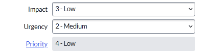

Assignment group went to Network, the group that would actually own a routing problem like this.

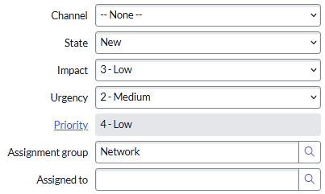

I added a description with the actual symptom before submitting. The user could reach the office LAN over Tailscale but not hosts on the remote subnet routed through it, and direct tailnet peers responded fine while only the subnet-routed hosts failed.

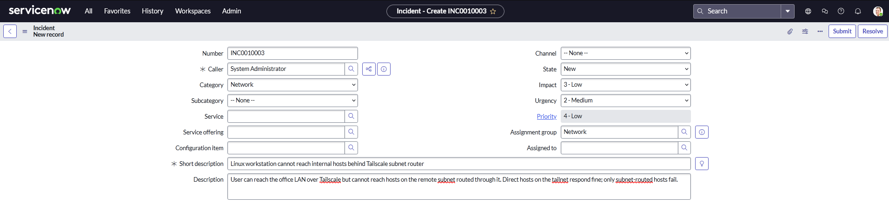

Submitting created INC0010003 with State New, Priority 4 - Low, Category Network, and Assignment group Network, sitting in the list next to the untouched demo record.

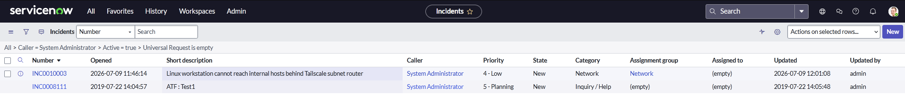

### Working the incident through its states

Typing "System Administrator" into Assigned to came back invalid. The picker offered five names instead, Bow Ruggeri, David Dan, David Loo, Fred Luddy, and ITIL User, all out-of-box demo accounts that ship with the instance.

My first read on that was wrong, and I'm leaving the correction in rather than quietly fixing the sentence. I assumed the field was filtering to users who hold an agent role. It isn't. It filters to members of the assignment group, which I'd set to Network a moment earlier. Those five names are the Network group's membership.

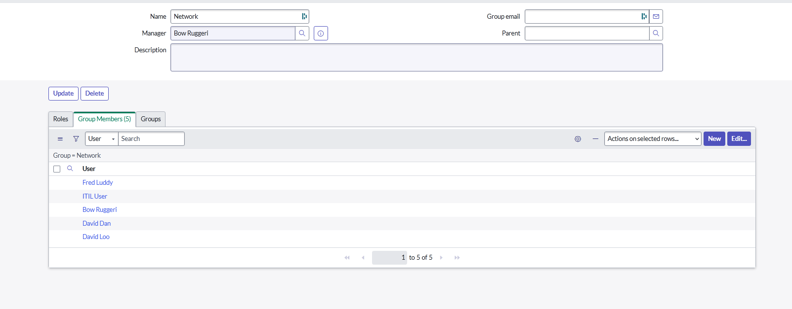

I only confirmed that in Step 2, where the same field came back completely empty on a catalog task and forced me to go look at the group record. Same qualifier, same rule, and the group was empty. Full account is in [why the Assigned to field kept coming back empty](#why-the-assigned-to-field-kept-coming-back-empty).

So System Administrator wasn't rejected for lacking a role. It just isn't in the Network group.

I assigned the incident to ITIL User, the clearest of the five for a portfolio piece since it reads as an obvious demo account rather than a real name. Once RBAC is built in Step 5 with actual named users, I can come back and reassign this ticket to one of those instead.

With Assigned to set, I moved State to In Progress and logged a work note with the real diagnosis:

> tailscale status showed the client connected to the tailnet, but pings to the advertised subnet timed out. Confirmed with the user that this is a Linux client, not Windows. Cause: Tailscale does not accept advertised subnet routes on Linux by default (Windows/macOS/iOS/Android do). Ran `sudo tailscale set --accept-routes` on the client. Verified with `ip route` that the subnet now routes through tailscale0. User confirmed the remote hosts are reachable.

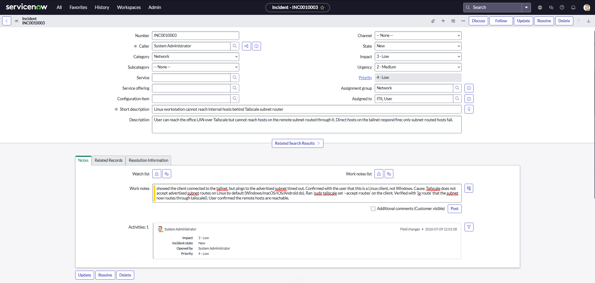

The list view now shows INC0010003 as In Progress, Priority 4 - Low, assigned to the Network group and ITIL User.

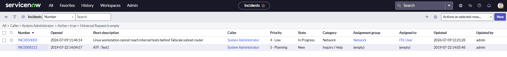

### Resolving and closing the incident

On the Resolution Information tab, the Resolution code defaulted to "Resolved by request," which didn't fit, nothing was requested here, a technical cause was found and fixed. The dropdown offers Duplicate, Known error, No resolution provided, Resolved by caller, Resolved by change, Resolved by problem, Resolved by request, Solution provided, Workaround provided, and User error.

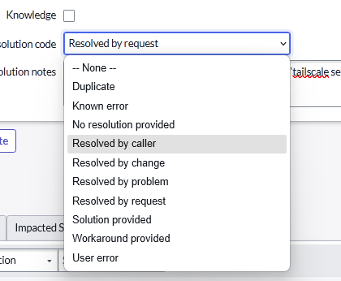

I picked Solution provided, since the assigned agent diagnosed the cause and applied a permanent fix rather than a workaround. Resolution notes:

> Enabled route acceptance on the Linux client with `tailscale set --accept-routes`. Confirmed the advertised subnet routes through tailscale0 and the user can reach the remote hosts.

Resolved by and Resolved are read-only until you act. They stamp themselves the moment you click Resolve.

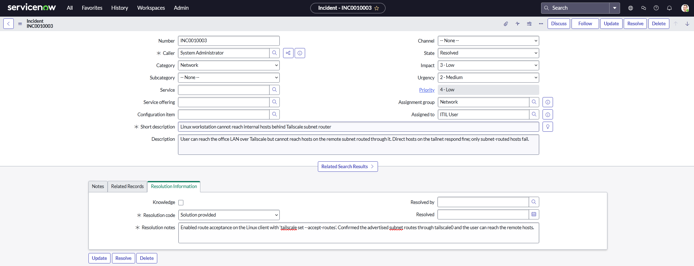

Clicking Resolve confirmed with a banner and dropped the incident to State Resolved in the list.

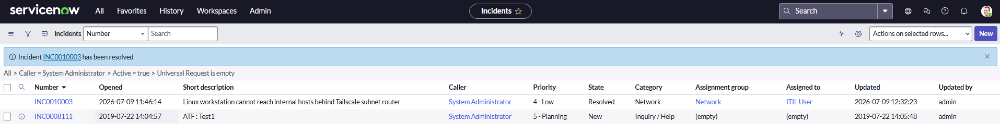

From there I set State to Closed and used the Close Incident action, not a plain Update, the same way Resolve was its own action rather than a manual field save. That stamped it as permanently closed and it fell out of the Active = true filtered list entirely, since Closed incidents aren't active.

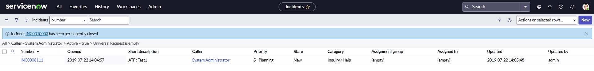

### Building a filtered list of active incidents

Dropping the Caller condition on the default list exposed a screen full of ServiceNow's built-in demo incidents on top of my own. I set a single condition, Active is true, and confirmed INC0010003 (closed) correctly dropped out of the results while INC0008111 (still New) stayed in. I added a sort on Priority, ascending, so 1 - Critical rows sort to the top instead of sitting wherever they land in the raw data, the order a real service desk queue would use.

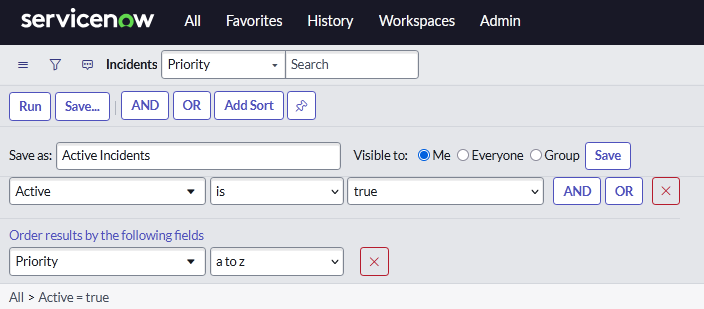

I saved it as a named list view, "Active Incidents," visible to me, so it is a reusable list rather than a one-off query.

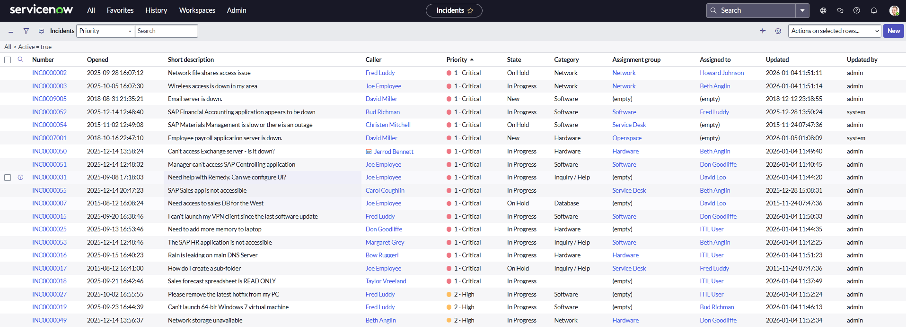

That closes out Step 1. I logged an incident with a real caller, category, and description, worked it through New, In Progress, Resolved, and Closed with notes at each step, and saved a prioritized view of what is still active.

## Step 2. Request management

Goal: submit a service request and show how it differs from an incident, through the request, the requested item, and the catalog task.

An incident is something broken. A request is something wanted. ServiceNow keeps them on separate tables with different fields and a different lifecycle, and the point of this step is to walk one request end to end so the difference is visible rather than asserted.

### Ordering from the service catalog

The Service Catalog is the end user's front door. It's organized by category (Hardware, Software, Desktops, Mobiles, Peripherals, Office, Services) with a Top Requests panel on the right, and it reads like a storefront, not a ticket form.

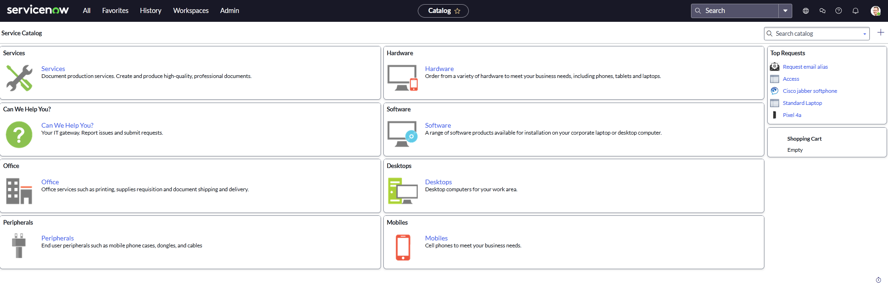

I ordered a Standard Laptop, a Lenovo Carbon x1 at $1,100 with a five day delivery estimate. The item has its own variables rather than the generic fields an incident has. I checked Adobe Acrobat under Optional Software and filled in the free text box with "VPN client and standard office suite per department image."

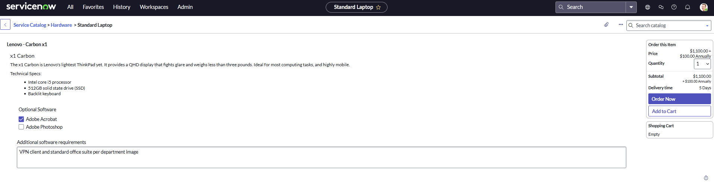

Order Now submitted it and returned an order status page with REQ0010001, an estimated delivery date of 2026-08-03, and a stage tracker showing eight steps with the first one lit. Nothing about this screen resembles an incident. There's no priority, no category, no assignment group, just a price, a delivery date, and a progress bar.

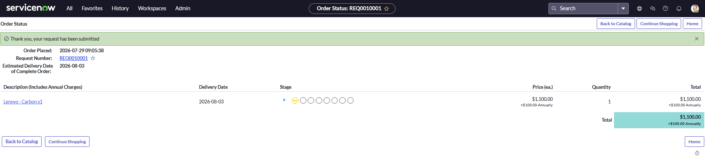

### Request, Requested Item, and Catalog Task

One catalog order creates three linked records, and understanding why is most of this step.

**REQ0010001** is the Request, the shopping cart. It tracks Requested for, Price, Due date, Approval, and Request state, which came in as Pending Approval. It has no Category, Impact, Urgency, Priority, or Assignment group. Its Requested Items related list holds the actual thing ordered.

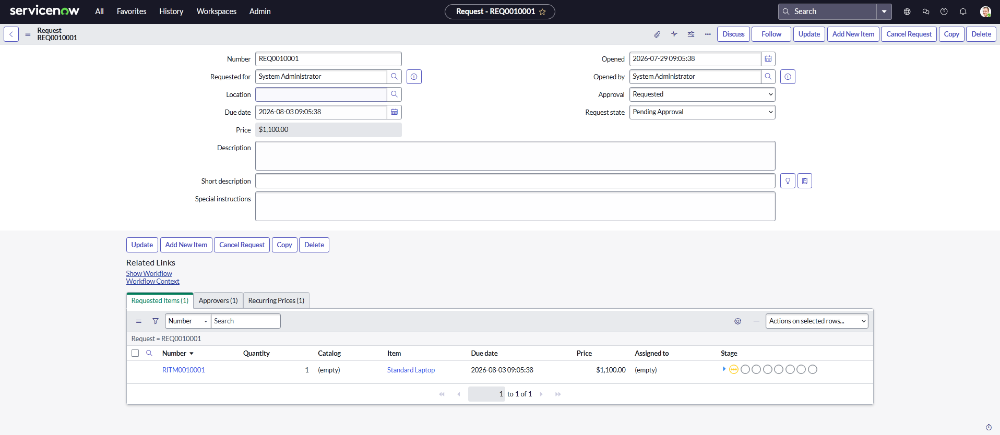

**RITM0010001** is the Requested Item, the line item. This is where the laptop itself lives, along with the variables I filled in on the catalog form and a read-only Stage field that showed Waiting for Approval. Worth noting from the Activities log at the bottom, this record does carry Impact 3 - Low and Priority 4 - Low under the hood. Requested Items extend the same base Task table an Incident does, so the plumbing is shared. The form just surfaces fulfillment fields instead of triage fields, because that's what the record is for.

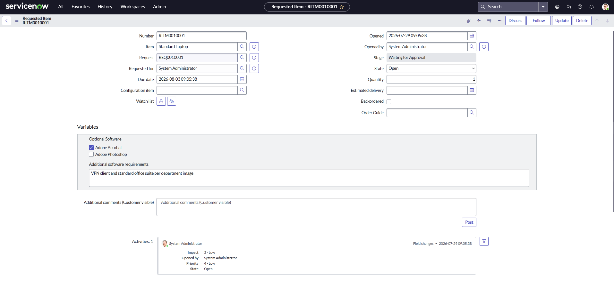

Approval turned out to be two layers deep. Approving at the Request level moved Request state to Approved but the item's Stage advanced only as far as Dept. Head Approval, which is read-only and derived from the workflow, the same way Priority was calculated rather than typed on the incident. The Requested Item carried its own Approvers list with two entries, Natasha Ingram already approved and Bow Ruggeri still Requested.

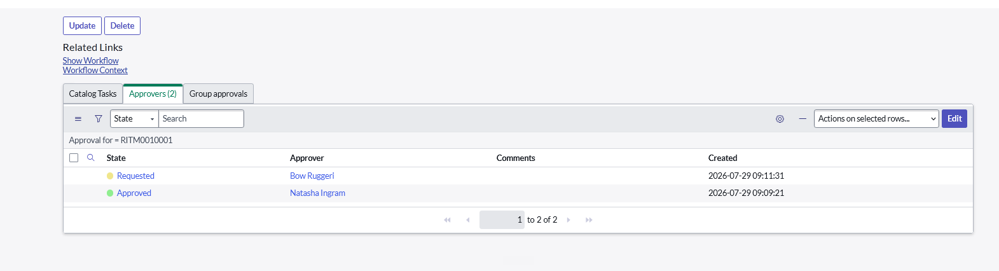

Approving the second one released the workflow, and a Catalog Task appeared.

**SCTASK0010001** is the Catalog Task, the actual work order. Short description "Please fulfill this order," with instructions to pull from stock or order from the vendor and flag it Backordered with an estimated delivery date if it has to be ordered. This is the record a fulfiller works, and it has the fields you'd expect for that, Assigned to, State, Priority, and Work notes.

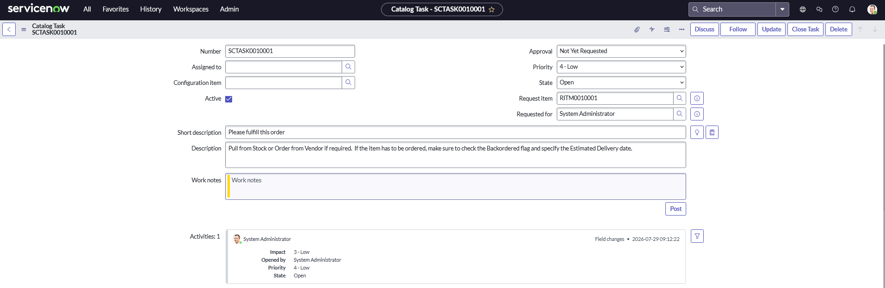

So the chain runs Request (what was ordered and approved), Requested Item (which item, with the options chosen), and Catalog Task (who does the work). An incident collapses all three into one record because there's nothing to approve and nothing to fulfill, there's just something broken that needs fixing.

### Why the Assigned to field kept coming back empty

This is the part that took the longest, and the reason is worth writing down.

Trying to assign SCTASK0010001, I typed a name into Assigned to and got a red invalid field. Opening the picker instead gave me an empty list. Not a short list, an empty one, "No records to display" on a table that plainly has users in it.

The field is a reference to the user table with a qualifier on it, and on a catalog task that qualifier limits the choices to members of the task's assignment group. This task had no assignment group. The form didn't even have the field on it, which is why there was nowhere obvious to set one.

I added it through the form layout editor, reached from the hamburger menu next to the record title, then Configure and Form Layout. Assignment group moved from Available to Selected, positioned just above Assigned to since the group gets filled in first.

Worth knowing before you do this. Editing the Default view changes the form for every catalog task in the instance, not just the one you're looking at. That's usually what you want, but it isn't a local change.

With Assignment group set to Hardware, the picker offered ITIL User and the assignment went through. Work notes recorded the fulfillment.

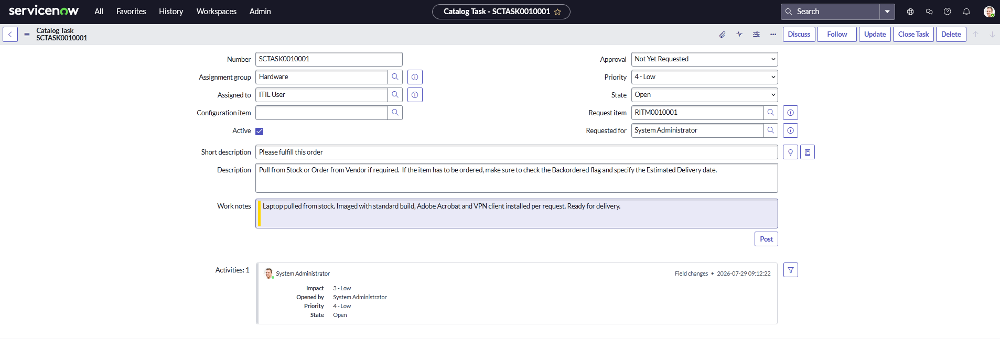

Close Task set State to Closed Complete, cleared the Active flag, and stamped the activity log.

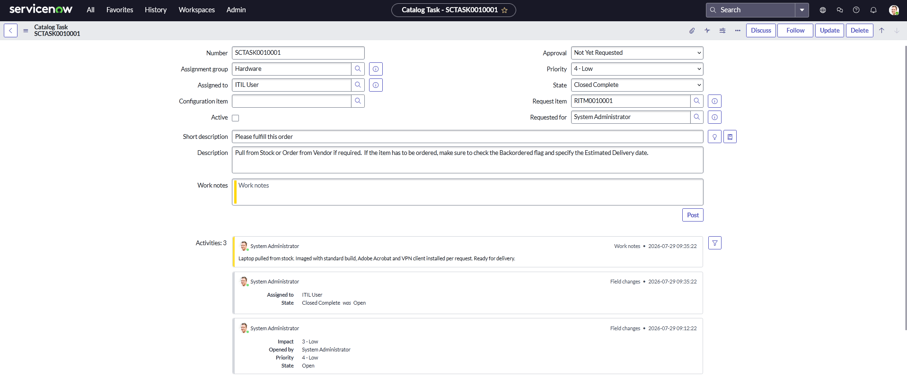

### A second task, and the same problem for a different reason

Closing the first task immediately created a second one. SCTASK0010002, "Please deploy item to the user," assigned to the Field Services group, opened at 09:35:22, the same second the first one closed. The workflow splits fulfillment into procure and deploy, so the Requested Item wasn't going anywhere until both were done.

This one already had an assignment group, so by my own explanation the picker should have worked. It came back empty again.

Rather than guess a second time, I opened the group itself. Field Services had two roles and zero members.

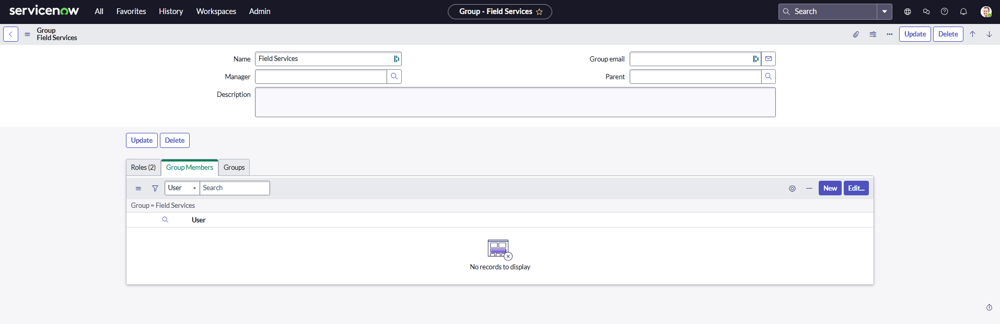

That's the real rule. The qualifier filters to group members, so an empty group produces an empty list whether or not a group is set. Hardware worked because ITIL User happened to belong to it. My first explanation was right about the mechanism and wrong about which condition had failed.

I added ITIL User to Field Services through the Edit picker on Group Members. The save queues a background job to propagate the group's roles to the user, so the related list still read empty until I reloaded the record.

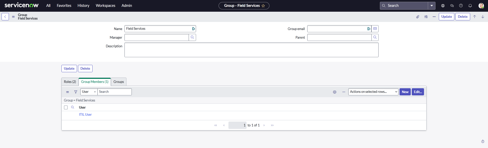

Back on SCTASK0010002 the picker worked with no form changes needed, since the layout edit had already applied instance-wide.

### The chain closing itself

Closing the deploy task finished the sequence. Both catalog tasks show an Actual end, both assigned to ITIL User, and the Requested Item flipped to Closed Complete at 09:50:56, the moment the last task closed.

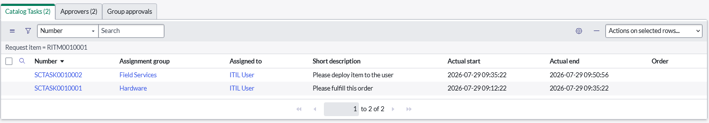

RITM0010001 Stage reads Completed and State reads Closed Complete.

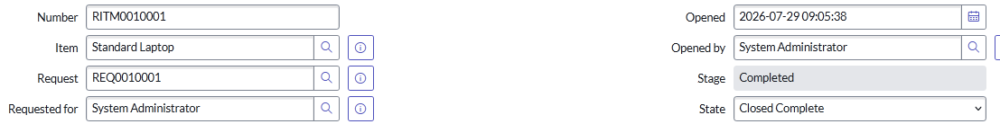

REQ0010001 followed with Approval Approved and Request state Closed Complete, and the stage tracker on the requested item filled in green.

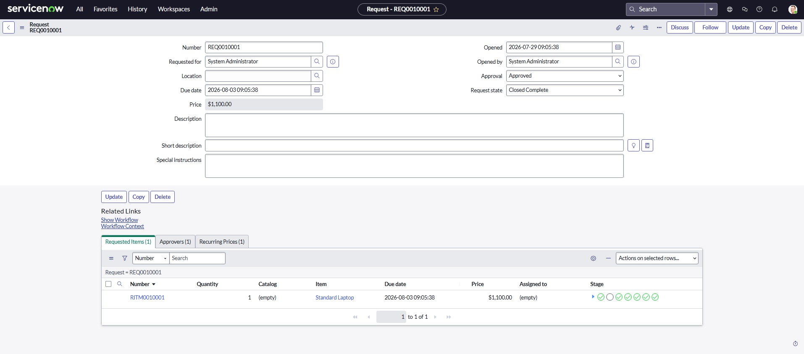

Nothing in that last sequence was a manual state change. I closed one task and the item and the request closed themselves, because the workflow owns the parent states and the tasks own the work. That's the structural difference from an incident, where I set every state by hand. A request is a workflow with records attached. An incident is a record with a state field.

## Step 3. Service catalog item with a Flow Designer workflow

Goal: build a catalog item the user submits from the portal, then wire it to a Flow Designer flow that routes an approval and creates a fulfillment task automatically.

Step 2 consumed a catalog item ServiceNow ships with the instance. This step builds one from nothing, which is the difference between using the platform and configuring it.

### Building the catalog item

I built a VPN Access Request. It's the kind of item that genuinely needs an approval gate rather than one invented to have something to approve, and it gives Step 5 a real group to attach roles to later.

New catalog items are created from the Catalog Items related list on the catalog record itself. The form asks for a name, a catalog, a category, and a short description.

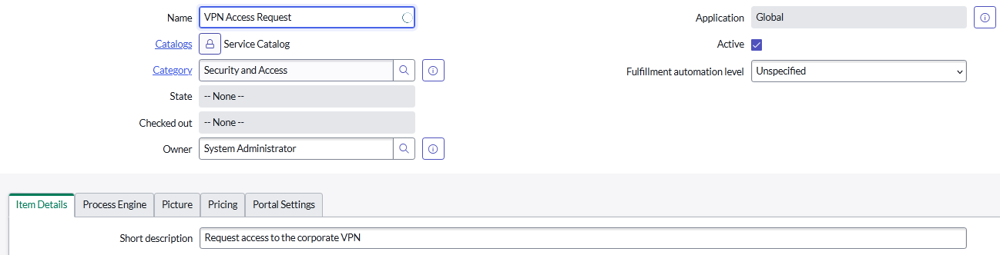

I got the category wrong the first time. Security and Access sounded right, but the rendered breadcrumb came back as Service Catalog > Facilities > Security and Access, and sitting under Facilities put it with building services rather than IT accounts. The right one was Application and Account Access, which lives under Software.

Three variables, which are the questions the requester answers on the form. A catalog item without variables is just a button.

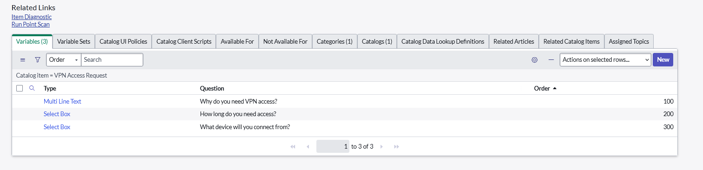

1. Why do you need VPN access? Multi line text, mandatory.
2. How long do you need access? Select box with 30 days, 90 days, and Permanent.
3. What device will you connect from? Select box with Company Managed Laptop and Personal Device.

The third one is there for a reason. Whether someone is connecting from a managed laptop or a personal machine changes the risk of granting the access, so it belongs on the form rather than in a follow-up email.

One thing to watch on select boxes. Adding choices through the inline row editor fills the Value column from the Text automatically on some rows and leaves it empty on others. An empty value stores a blank when the user picks that option, so it's worth checking both columns before moving on rather than finding out after a request comes through with nothing in it.

Try It renders the item the way a requester sees it, with the mandatory markers and the populated dropdowns.

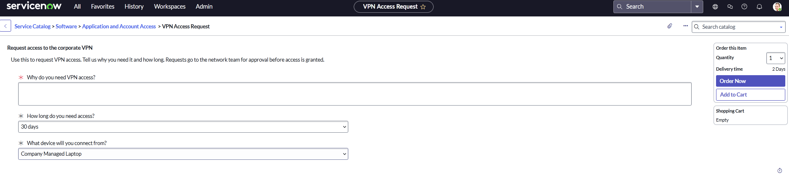

### Building the flow

Flow Designer now lives inside Workflow Studio. The instance already had 71 flows in it, none of them mine, so a new one starts from New and then Flow.

The trigger I needed was Service Catalog, which sits under the Application group rather than Record or Scheduled. Worth knowing, because the trigger doesn't ask which catalog item it belongs to. The relationship runs the other way. The item points at the flow through its Process Engine tab, and that tab spells out the constraint, only one engine can drive an item.

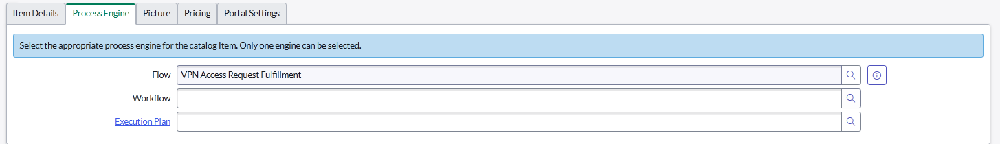

Attaching the flow also cleared the Execution Plan field on its own, which is the same rule enforcing itself.

The first version had three steps.

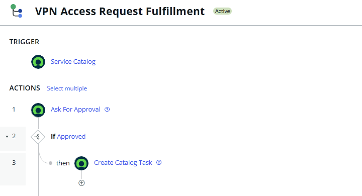

1. **Ask For Approval** on the Requested Item record, with the rule set to Anyone approves and the approver set to the Network group. Setting a static group rather than a data pill takes the second of three small person icons next to the rule, which is not obvious.
2. **If** the approval state is Approved.
3. **Create Catalog Task** inside that If, with Short Description set and Assignment group set to Network.

Gating the task behind the If is the part that matters. Ask For Approval pauses the flow until someone decides, but it resumes either way, approved or rejected. The condition is what keeps a rejection from producing a fulfillment task anyway. I only ran the approved path, so that is the reason for the design rather than something I watched fail.

### Testing it as requester, approver, and fulfiller

Ordering the item created REQ0010002 and RITM0010002. The order status screen looked thinner than the laptop's in Step 2, with an almost empty Stage column instead of an eight dot tracker, which is the first visible sign of a flow-driven item rather than a workflow-driven one. The Related Links on the RITM say Flow Context where the laptop said Show Workflow. That confirms Step 2's item runs on the legacy engine.

The flow created five approval records, one for each member of the Network group, the same five accounts I'd confirmed as that group's membership back in Step 1. Anyone approves means one of the five is enough.

Catalog Tasks stayed empty while those approvals sat pending.

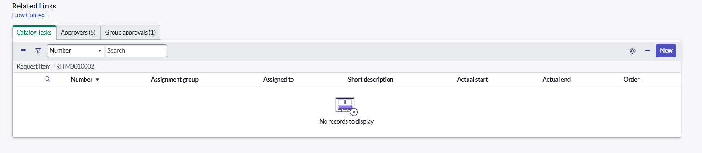

Approving as ITIL User released it and SCTASK0010003 appeared, assigned to Network, with the short description the flow supplied.

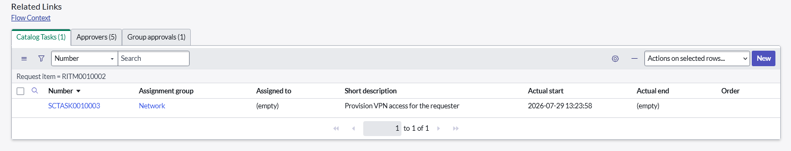

The related list needed a manual refresh before the task showed up, the same staleness I hit adding a group member in Step 2. Worth remembering before concluding something is broken.

### Where it fell short, and the fix

I closed the catalog task, and then the chain stopped.

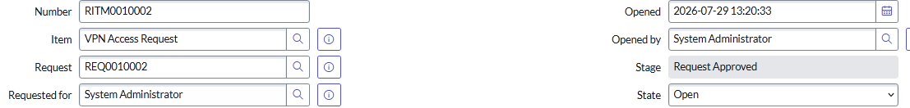

State Open, with the task closed. In Step 2 the legacy workflow closed the requested item and the request without being asked. My flow did not, and the reason is simple once you see it. The legacy workflow was authored with explicit close steps. Mine ended after creating the task, so nothing closed the parent. Flow Designer gives you nothing for free.

I left RITM0010002 in that state rather than closing it by hand, because a manually closed record would have hidden the defect from anyone reproducing this.

The fix was a fourth action inside the If, an Update Record on the Requested Item setting State to Closed Complete, positioned after Create Catalog Task. Because the Create Catalog Task action has Wait selected, the flow holds there until the task closes, so the update runs at the right moment rather than immediately.

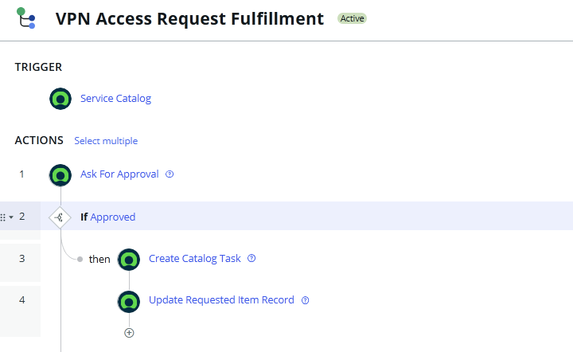

Editing an active flow leaves the change unpublished until you click Activate again. Save alone is not enough.

Then I ran the whole thing a second time on a fresh request to prove the fix rather than assume it. REQ0010003 and RITM0010003, approved by ITIL User, task SCTASK0010004 closed at 13:39:53.

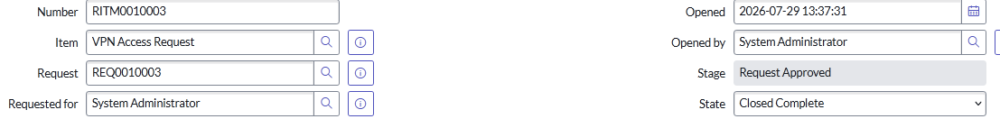

The requested item flipped to Closed Complete at 13:39:54, one second later, without anyone touching it.

One thing I did not fix. Stage still reads Request Approved on the closed record, because Stage is a separate field and nothing in my flow writes to it. The legacy engine maintains that label as a side effect of running. A flow only sets what you tell it to. State is the field that actually governs whether the item is open, so the record behaves correctly, but the label is cosmetically stale and I would rather say that than pretend the run was spotless.

That is the real lesson from this step. The legacy workflow felt like it did more because that behavior was baked into the engine. Flow Designer is explicit, which means it is readable and maintainable, and it also means every state change you want is a step you have to write.

## Step 4. Knowledge base articles

Goal: publish the two knowledge articles already drafted, one for a common fix and one for a standard procedure, categorize them, and link one to an incident. That incident has to be a new one worked only as far as In Progress, since closing INC0010003 locked most of its fields.

Drafted and ready to paste into the knowledge base:

1. [Linux client cannot reach hosts behind a Tailscale subnet router](knowledge-base/kb01-linux-tailscale-subnet-routes.md) (troubleshooting, common fix)
2. [Configure SSH for key-based authentication and disable password login](knowledge-base/kb02-ssh-key-based-authentication.md) (how-to, hardening procedure)

### Logging a fresh incident

KB01 already ties to INC0010003 from Step 1. For this step I logged a second incident tied to KB02's SSH hardening procedure, a Linux server flagged by a vulnerability scan for having SSH password authentication enabled.

New from the incident list dropped me on the same stripped-down Self Service form as Step 1, so I switched to Default view and clicked New from there for the full form, same fix as before.

The Category dropdown on the full form doesn't have a Security option. The instance ships with six: Inquiry / Help, Software, Hardware, Network, Database, Password Reset.

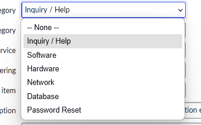

I picked Software, this is an OpenSSH server configuration issue, not a password reset request and not a network problem. For Impact and Urgency: one server affected, not a site or a team, so Impact went to 3 - Low. Nothing was down and no one was blocked, but it's an active security exposure, an attacker could get in with a guessed password, so Urgency went to 2 - Medium. Priority calculated to 4 - Low, same as INC0010003.

### Finding an assignment group

The instance has 44 groups. I searched "Security" first, hoping for a dedicated group. The search box turned out to sort alphabetically from the term rather than filter by substring, so "Security" landed on Service Desk, Software, Team Development Code Reviewers, and the US Presidents groups, nothing with "Security" in the name.

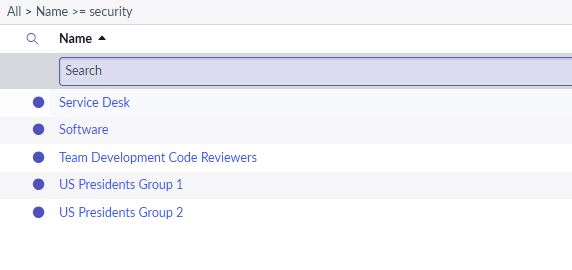

No dedicated Security group exists, but Software does, and it matches the Category I'd already set. I used that, then added the description:

> A vulnerability scan of the Linux application server found OpenSSH configured with PasswordAuthentication enabled. Password login is exposed to brute-force attempts. Needs to be moved to key-based authentication with password login disabled.

Submitting created INC0010012, State New, Priority 4 - Low, Category Software, Assignment group Software. The list also shows a stray leftover record, "NO!! I will not DO things for you.", that neither of us created, unrelated instance clutter from earlier testing.

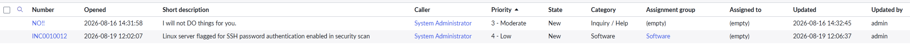

### Assigning and working the incident

Same qualifier as Step 1's Network group: Assigned to filters to members of the assignment group, not to a role. The Software group has five members, Beth Anglin, David Loo, Don Goodliffe, Fred Luddy, and ITIL User. I assigned it to ITIL User, the same demo account used for INC0010003, so the walkthrough stays consistent. State went to In Progress with a work note:

> Confirmed sshd_config on the flagged host has PasswordAuthentication yes. Following the SSH key-based authentication KB procedure to generate a key, install it, verify key login, then disable password authentication.

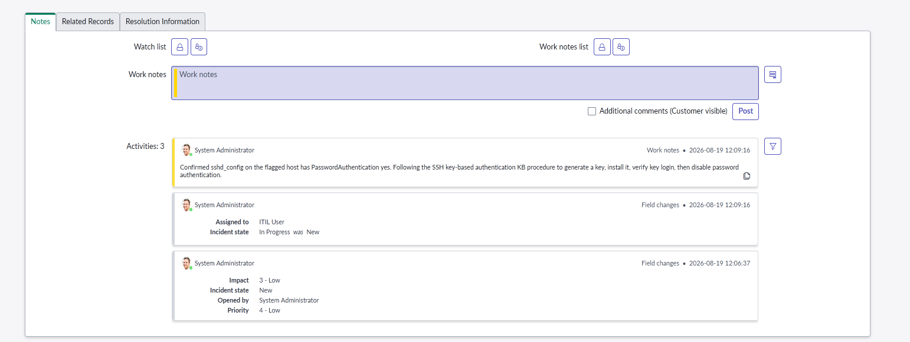

INC0010012 stays at In Progress here. Linking the KB02 article comes next, and it has to stay open until Step 6 attaches a configuration item to it too.

### Finding the knowledge base module

Searching "knowledge" in the All menu turned up several unrelated matches, an Authentication Factors module also named Knowledge Based Factor, a Self-Service knowledge article view, and a System Mobile "Knowledge Bases" entry that turned out to be part of the mobile app configuration, not article management. Narrowing to "knowledge base" surfaced the real one: Knowledge > Administration > Knowledge Bases.

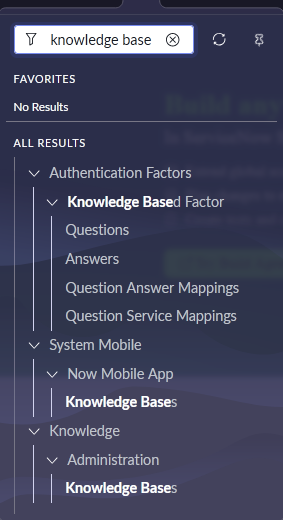

That opened a list of four knowledge bases the instance ships with, KCS Knowledge Base (demo data), Known Error, Knowledge, and IT, "The ACME North America IT Service Desk Knowledge Base." IT is the one both drafts specify. Its publish workflow is "Knowledge - Approval Publish," meaning new articles need approval before going live, and it already had 42 articles and 8 categories.

### Adding the two categories

The 8 existing categories, News, Applications, Devices, IT, Email, Suppliers, Operating Systems, Service Design Package, don't include what either draft specifies. KB01 wants "Network and Remote Access," KB02 wants "Security and Hardening." Category editing wasn't disabled on this knowledge base, so I added both rather than force the articles into a category that didn't fit.

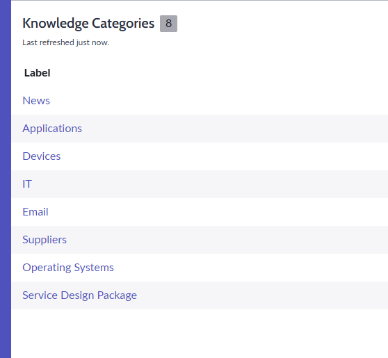

First attempt at the label came out "Network Remote Access," missing "and." Caught it before saving and fixed it to match the draft exactly. Both categories in, 10 total.

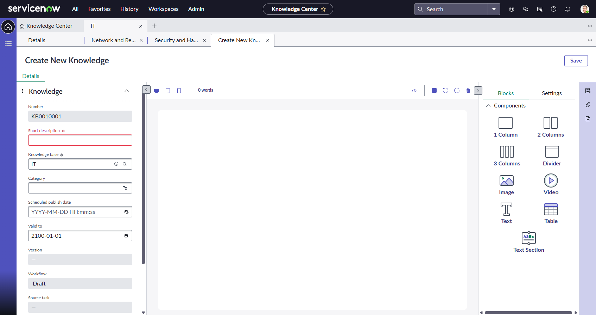

### Writing KB01 in the block editor

New from the Knowledge (42) list assigned KB0010001, defaulted Knowledge base to IT, no Article type field on this create layout despite the draft listing one, the instance just doesn't expose it there. Short description and Category set to match the draft.

The content area is a block-based page builder, not a text field, clicking into blank canvas does nothing. I initially assumed it needed a Text Section component dragged in first, but the real fix was the `</>` Edit code icon in the toolbar, which opens a raw HTML editor.

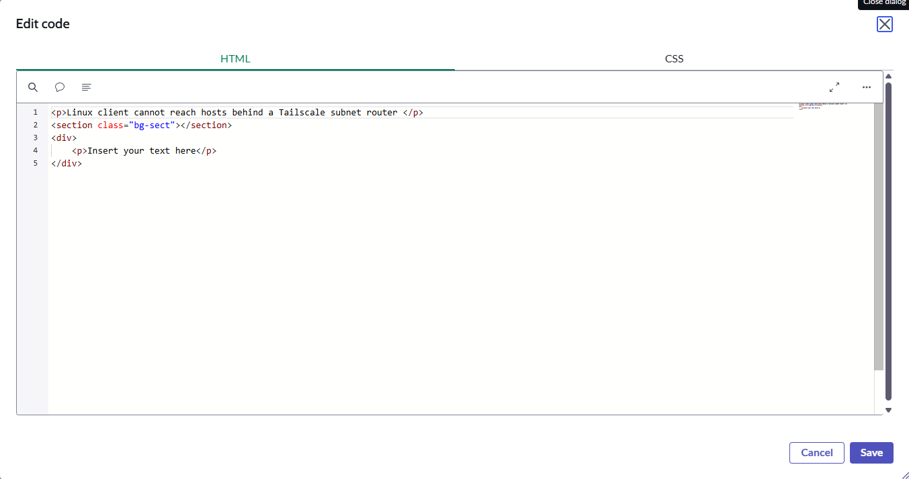

I converted the full KB01 markdown to HTML by hand and pasted it in wholesale rather than fighting the block editor line by line. It rendered clean, headings, lists, and code blocks all came through, 556 words.

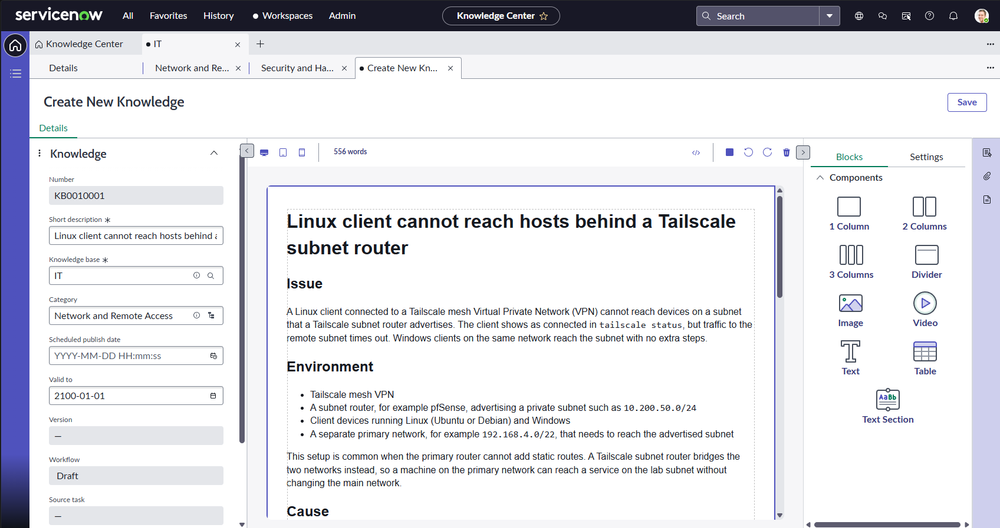

### Publish, approve, and a copy-paste bug

Publish didn't go live directly, it routed to the KB's approval workflow, "Knowledge - Approval Publish," waiting on Bernard Laboy, the IT knowledge base's owner. As admin I approved it directly rather than impersonating Bernard Laboy.

I copy-pasted my own instruction text into the Short description field instead of just the article title, so the field read `Linux client cannot reach hosts behind a Tailscale subnet router" (matches the KB01 draft exactly)`, a stray quote and my parenthetical both included. It was visible right on the public article page.

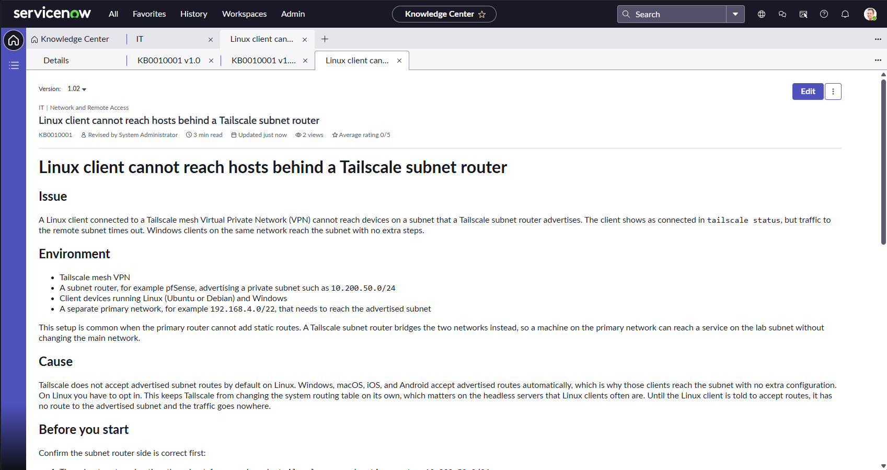

Fixing it took a few wrong turns of my own, since the article was Published I couldn't edit the field directly, I had to find a Checkout action first, which pulls it back into a draft. Once checked out, the Short description field turned out to be behind a collapsed side panel I initially couldn't locate. The two versions sat side by side afterward, v1.0 with the bad text still Published, v1.02 with the correct text in Review.

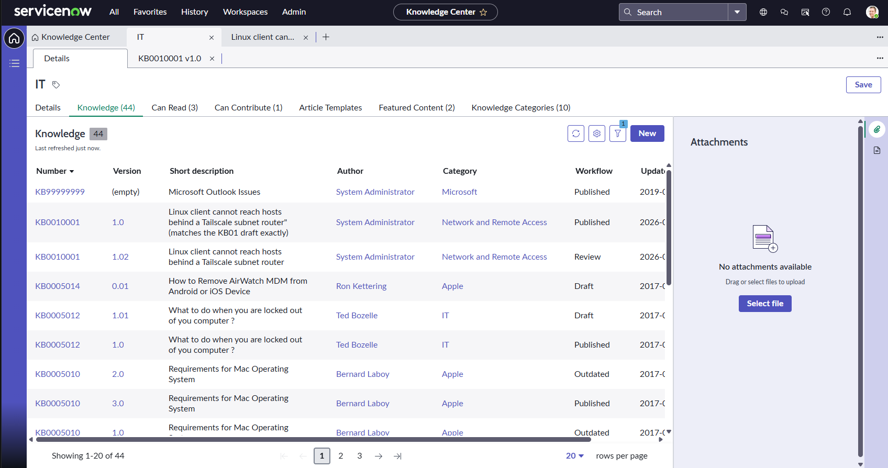

Approving v1.02 promoted it to v2.0 Published and superseded v1.0 as the live version. This time I typed the short description directly instead of copying it from chat.

### KB02, the same process, no repeat of the bug

KB0010002, Category Security and Hardening, HTML pasted the same way as KB01, 582 words. Same approval cycle, approved cleanly to v1.0 with no short description bug this time.

### Linking KB02 to the incident

INC0010012's "Related Search Results" panel, set to "Knowledge & Catalog (All)," returned only service catalog items, Password Reset, Endpoint Security, a couple of server catalog entries, nothing from the knowledge base.

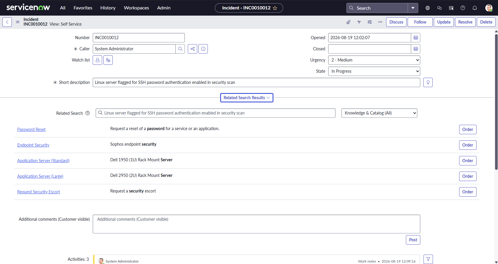

Narrowing the filter dropdown to "Knowledge Articles" surfaced KB0010002 directly.

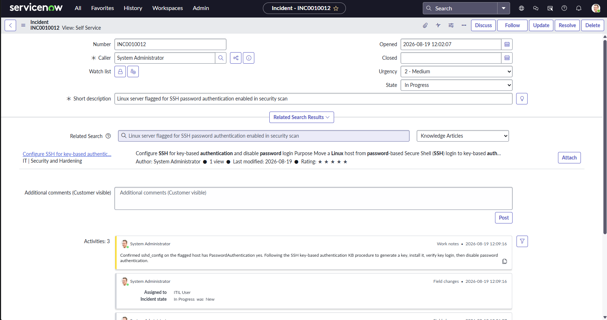

Clicking Attach dropped raw markup into the Additional comments field instead of a rendered link, `[code]<a title="..." href='kb_view.do?...'>...</a>[/code]`, literal brackets and all. I assumed this was a Self Service view limitation, since that view had caused problems twice already in Step 1 and Step 2. Switching to Default view and repeating the search and Attach produced the identical raw text, so the Self Service theory was wrong.

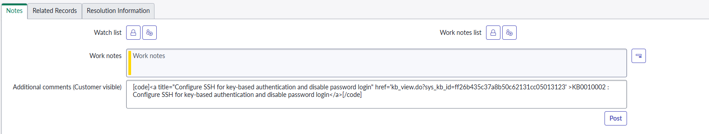

The `[code]...[/code]` wrapping turned out to be intentional, ServiceNow's syntax for embedding a link inside a plain-text journal field. It looks like broken markup in the input box but renders as an actual clickable link once posted.

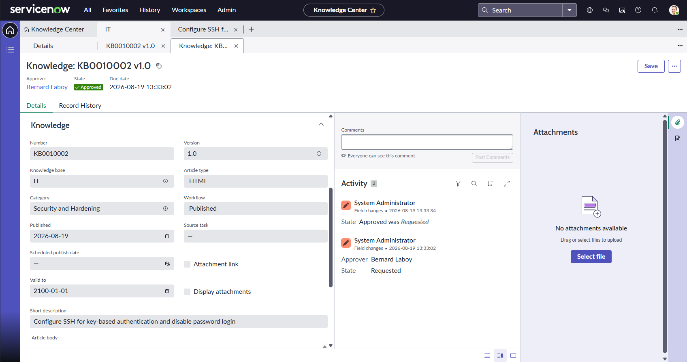

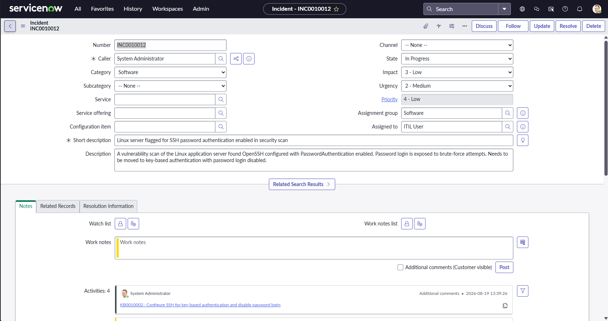

Both articles are published in the IT knowledge base now, KB0010001 categorized Network and Remote Access, KB0010002 categorized Security and Hardening, and KB0010002 is linked to INC0010012, which stays In Progress until Step 6 attaches a configuration item to it.

## Step 5. Role-Based Access Control

Goal: create users, put them in groups, assign roles, and show that access follows the role, a fulfiller can work tickets, a requester sees only their own.

I created two users. Alex Rivera is the fulfiller, added to the Network group from Step 3's approval routing and given the itil role. Jordan Lee is the requester, left with no group and no elevated role, an ordinary end user.

Adding the itil role to Alex cascaded into 46 roles total, sn_incident_write, sn_change_write, and dozens more. That's expected, itil bundles a large set of contained roles by design, not a mistake on my part.

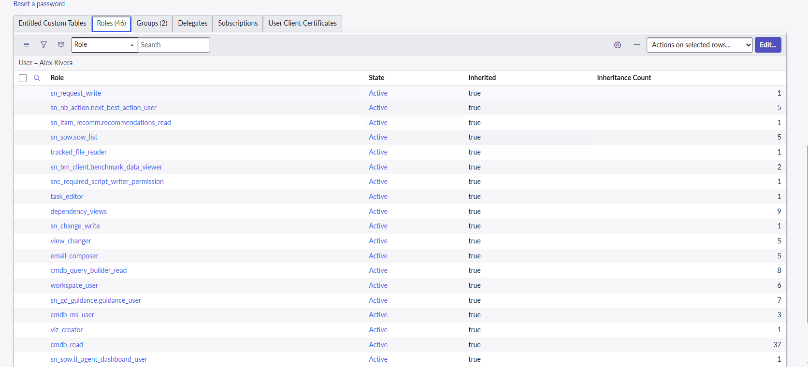

The group side had a real wrong turn. I only added Alex to Network, but his Groups list came back showing Network and a second group I never touched, Conditional Script Writer. I removed it twice, through the row delete and through the multi-select editor, and it came back both times. ServiceNow groups have two paths into membership, one you set by hand and one computed automatically for anyone holding a matching role on the group's Roles field. Since itil's bundle is large, it's likely satisfying whatever role Conditional Script Writer requires, which would explain why manually removing the row does nothing, the membership isn't stored, it's recalculated. I didn't chase down which specific role in the bundle triggers it. Deleting and recreating Alex would not have fixed this either, since it's tied to the itil role itself, not the user record, so I left it as a known cosmetic quirk instead of a solved problem.

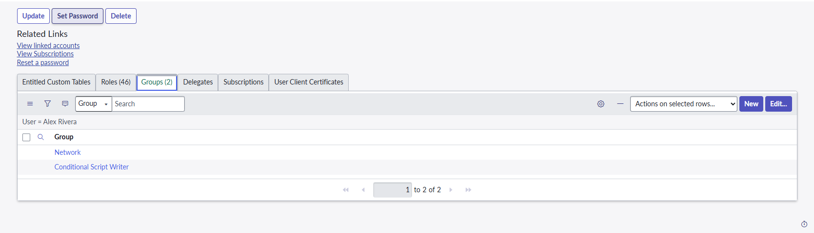

### Proving access follows role

I impersonated Jordan Lee and submitted a new incident through the Service Catalog's "Create Incident" request, a more realistic requester path than the direct incident form I used in Steps 1 and 4. First pass at Urgency was 1 - High, which I walked back to 2 - Medium to stay consistent with how I'd rated a single fully-blocked user everywhere else in this project, INC0010003 and INC0010012 both got Medium for the same kind of single-user impact.

INC0010013 came in as expected, Impact 3 - Low, Urgency 2 - Medium, Priority 4 - Low, Caller Jordan Lee.

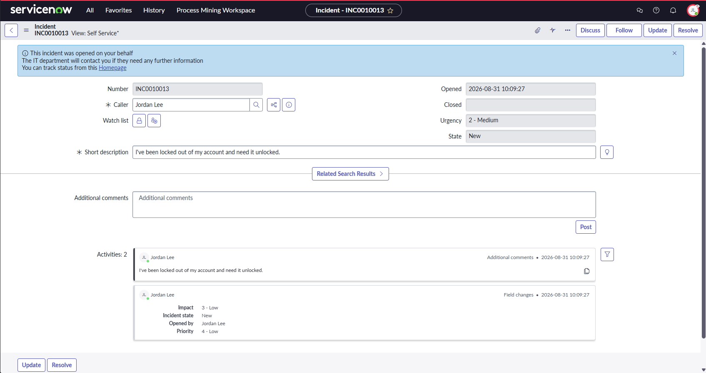

Jordan's own incident list showed exactly one row, INC0010013. Nothing else in the system was visible to them, not INC0010003, not INC0010012, nothing.

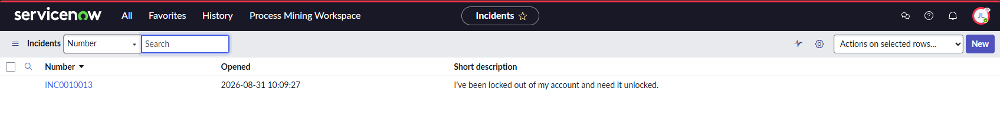

I stopped impersonating Jordan and impersonated Alex Rivera instead. His incident list showed INC0010013 immediately, a ticket he didn't open and isn't the caller on, which is the itil role's broader read access at work rather than the caller-scoped view Jordan gets.

I set Assignment group to Network and Assigned to to Alex Rivera, tying this back to Step 3's group rather than a throwaway assignment, then worked it the same way as INC0010003, State to In Progress with a work note, then Resolved with a resolution code and notes.

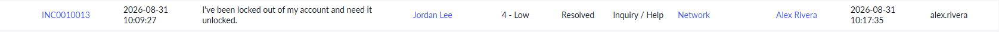

That's the RBAC demonstration complete, a fulfiller with itil and group membership can see and work tickets beyond their own, a plain requester sees only what they opened.

## Step 6. CMDB example

_Not built yet. Goal: add a few configuration items, give them a relationship or two, and attach one to the still-open incident from Step 4 so the ticket shows the affected asset._

## Step 7. Dashboard and reporting

_Not built yet. Goal: build a dashboard with the active incident and request queue and a breakdown by priority or category._
